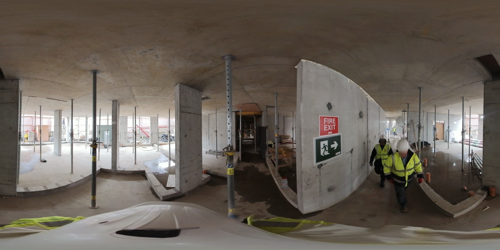

# Face Blurring

This repository contains a face blurring experiment. The dataset used is composed of 360 equirectangular images. Also includes thumbnails.

## Approaches
This project leverages different deep learning models for face detection + blurring:

### [RetinaFace](https://github.com/serengil/retinaface?tab=readme-ov-file)

- Best accuracy has been observed with this model.
- Downloads the weights of the model, this is a library and not an API

### [MTCNN - Multitask Cascaded Convolutional Neural Networks](https://github.com/ipazc/mtcnn?tab=readme-ov-file)

- Missed some samples where the face is oriented to left/right -> partially occluded. 
- Low accuracy compared to RetinaFace.
- Downloads the weights of the model, this is a library and not an API


### [DeepFace](https://github.com/serengil/deepface?tab=readme-ov-file)

- This has multiple backends including MTCNN and RetinaFace that are explored above, it also has `fast-mtcnn` that is supposed to be a faster MTCNN version, its results are still low comparable to both MTCNN and RetinaFace.
- Downloads the weights of the models, this is a framework and not an API

### YoloV11 + [Face Recognition API](https://github.com/ageitgey/face_recognition?tab=readme-ov-file)

- This is a 2 stage solution: Person detection and cropping + Face localization
- Worst accuracy, Yolo provided excellent person detections, however the Face recognition API was not able to locate perfectly visible faces.
- The Face recognition package is an API

### [Blur360](https://github.com/thaytan/blur360?tab=readme-ov-file)

- This is a C++ repository that does both face detection and blurring
- Modified the code to handle a full directory of images rather than just one input image as its original design.
- Built it with Meson and compiled it with Clang v15, enforced usage of C++ v17 to use the filesystem library.
- This yielded good results overall, slightly better than MTCNN and DeepFace but not as accurate as RetinaFace.
- The modified code is stored in my local. Can share it if requested.
- Contains the weights of the model, this is not an API


## Installation
To get started, clone the repository and install the required dependencies:

```bash
git clone https://github.com/Rachelslh/face_recognition.git
cd face_recognition
pip install -r requirements.txt
```

## Usage

```bash
python main.py --model retina_face
```

## Results
Results are stored [here](https://drive.google.com/drive/folders/1c6ldhoE72zVqXa8KLjEhRUR1rYbqJ74Y?usp=sharing).

<p align="center">
  
</p>
